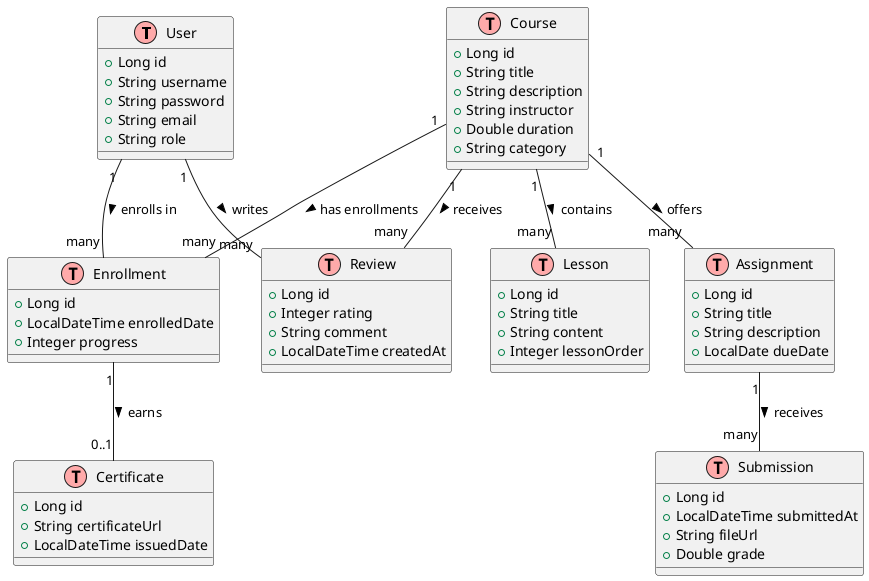

# Online Learning Management System (LMS) API

This project is a RESTful backend for an Online Learning Management System built with Spring Boot, Spring Data JPA, Spring Security with JWT, and PostgreSQL. It features role-based authentication (STUDENT and ADMIN) for managing courses, enrollments, lessons, assignments, submissions, and certificate generation.

## Features

- **User Authentication:**
  - **Registration & Login:** Users register and log in to obtain a JWT token.
  - **Role-based Access:** New users are assigned the STUDENT role by default; ADMIN-only endpoints are secured.
- **Course Management:**
  - **Public Endpoints:** Students can view available courses and course details.
  - **Admin Endpoints:** Administrators can create, update, and delete courses.
- **Enrollment:**
  - Students can enroll in courses and track their progress.
- **Lesson & Assignment Management:**
  - View lessons for each course.
  - Assignments are listed per course with deadlines.
  - Students can submit assignments.
- **Certificate Generation:**
  - Once enrollment criteria are met, a certificate (stubbed) is issued.
- **Additional Modules:**
  - **Wishlist & Coupons:** (For future extension; see code placeholders.)
  - **Product Reviews:** (Students can review courses and share feedback.)

## Architecture & Entity Relationships

The project is organized into distinct layers for controllers, services, repositories, and domain entities. The following UML diagram (in PlantUML syntax) visualizes the main entity relationships:

### UML Diagram

## Technologies Used
 - Java 11+
 - Spring Boot
 - Spring Data JPA
 - Spring Security with JWT
 - PostgreSQL
 - Lombok
 - BCrypt for password hashing
 - Maven
